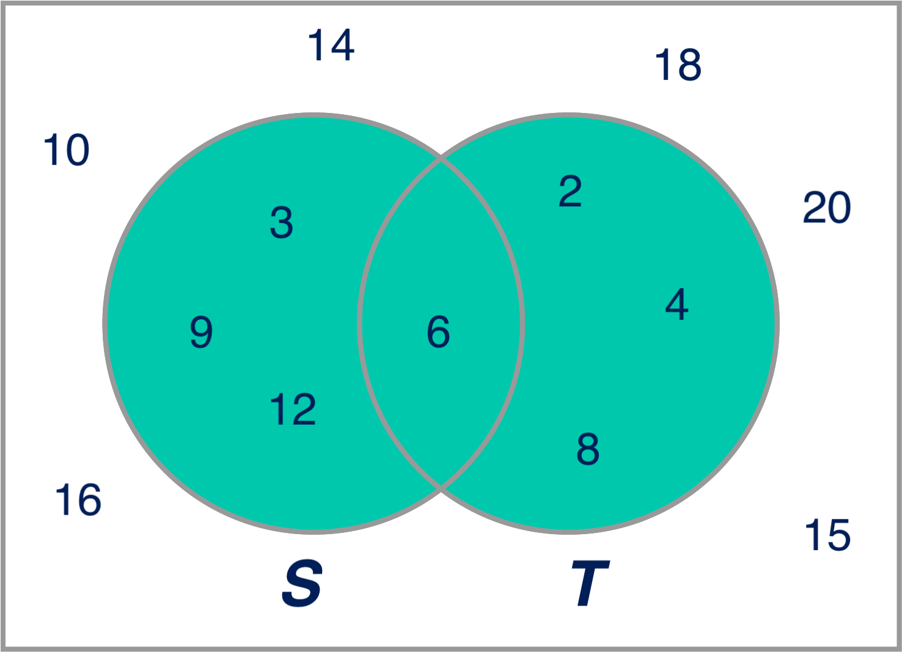
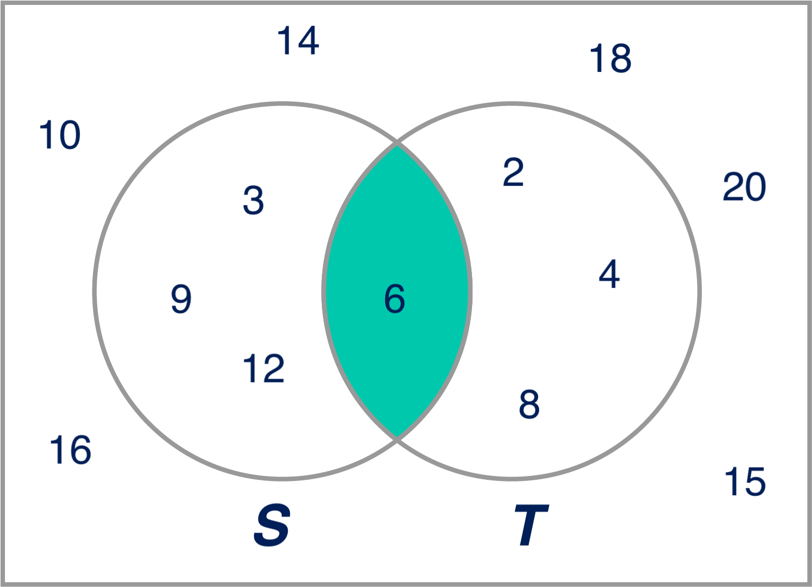
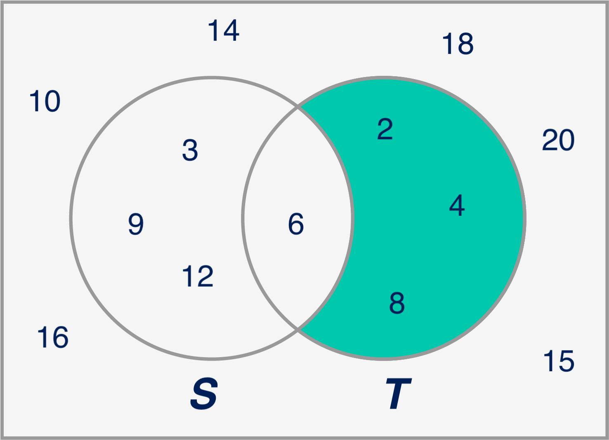
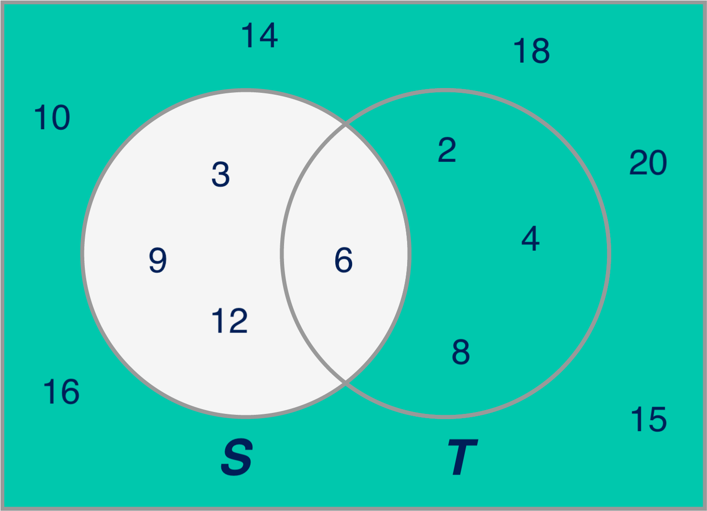

# Introduction to Sets

## Introduction

You have definitely heard of sets before. In this section, however, you will learn about the formal definition of sets, which will serve as a foundation for everything related to probability and combinatorics!

## Objectives

You will be able to: 

* Define a set in the context of probability theory
* Define a universal set and subsets
* Describe the process of making unions, intersections, and complements
* Use Venn Diagrams to visually demonstrate set operations
* Describe the inclusion-exclusion principle

## What is a Set? 

In probability theory, a set is defined as a *well-defined collection of objects*. 

Mathematically, you can denote a set by $S$. If an element $x$ belongs to a set $S$, then you'd write $x \in S$. On the other hand, if $x$ does not belong to a set $S$, then you'd write $x\notin S$.

Example: If $S$ is defined as the set of even numbers, then:

* If $x = 2$, $x\in S$ because $x$ is an even number.

* If $x = 9$, $x\notin S$ because $x$ is not an even number.

## Subsets

Set $T$ is a subset of set $S$ if *every element* in set $T$ is also in set $S$. The mathematical notation for a subset is $T \subseteq S$. 

Typically, you'll be more interested in *proper subsets*. All proper subsets are subsets. The only difference between subsets and proper subsets is that a subset can technically be the entire set. In other words, if A = {1,2,3} and B = {1,2,3} A is subset of B. If C = {1,2} then C is both a subset and proper subset of A. C is also a subset and proper subset of B. The mathematical notation for proper subsets is : $ C \subset A $

**Example**: If S is the set of even numbers, set $T = \{2, 6, 22\}$ is a proper subset of $S$. Formally, you can write this as $T \subset S$. $T \subseteq S$ is also correct in this case!

## Universal Sets

The collection of all possible outcomes in a certain context or universe is called the **universal set**.
A universal set is often denoted by $\Omega$.

Example of a universal set: All the possible outcomes when rolling a dice.

$\Omega = \{1,2,3,4,5,6\}$

Remember that a universal set is not necessarily all the possible things that have ever existed. Typically, a universal set is just all the possible elements within certain bounds, e.g., the set of all countries in the world, the set of all the animal species in the Bronx Zoo, etc.

A universal set can have an infinite number of elements, for example, the set of all real numbers!

## Elementary Set Operations

Next, let's talk about set operations. Imagine you have two sets of numbers, say the first 4 multiples of 3 in set $S$:

$ S = \{3,6,9,12\}$

and the first 4 multiples of 2 in set $T$:

$ T = \{2,4,6,8\} $.

### a) Union of Two Sets

The union of two sets $S$ and $T$ is the set of elements of either S or T, or in both.  

Applied to our example, the union of $S$ and $T$ is given by the elements $\{2,3,4,6,8,9,12\}$. 

In mathematical terms, the union of $S$ and $T$ is denoted as $S \cup T$.

A popular way to represent sets and their relationships is through Venn Diagrams, (https://en.wikipedia.org/wiki/Venn_diagram), see picture below!

### b) Intersection of Two Sets 

The intersection of two sets $S$ and $T$ is the set that contains all elements of $S$ that also belong to $T$. 

Applied to our example, the intersection of $S$ and $T$ is given by {6}, so it contains the elements that are multiples of both 2 AND 3.

In mathematical terms, the intersection of $S$ and $T$ is denoted as $S \cap T$.

### c) Relative Complement or the Difference

If you have S and T, the relative complement of S contains all the elements of T that are NOT in S. This is also sometimes referred to as the *difference*. The difference is denoted by $ T\backslash S $ or $T-S$.

In this case, the relative complement of S (or $ T\backslash S $) is $\{2,4,8\}$. The relative complement of T (or $ S\backslash T $) is $\{3,9,12\}$.

### d) Absolute Complement

There is another definition of the complement when considering universal sets $\Omega$ as well. In this context, we're talking about the *absolute complement*.

The absolute complement of $S$, with respect to the Universal set $\Omega$, is the collection of the objects in $\Omega$ that don't belong to $S$.

Note how the definition of $\Omega$ is very important here. Imagine a set $S= \{\text{elephant, alligator, tiger, bear}\}$. The complement of this set will depend on how the universal set is defined: Is $\Omega$ equal to *the animals in the Bronx Zoo*, or *the 20 most deadly animals in the world*?

Mathematically, the absolute complement of $S$ is denoted as $S'$ or $S^c$.

Let's reconsider $S$ and $T$ as defined previously.

Let's define $\Omega$, the universal set (denoted by the box around the two Venn diagrams), as the set that contains the multiples of both 2 and 3 until 20. Then the elements of $\Omega$ are $\{2,3,4,6,8,9,10,12,14,15,16,18,20\}$. 

The absolute complement of $S$ (so, $S'$ or $S^c$) is then given by $\{2,4,8,10,14,15,16,18,20\}$.

## Inclusion-Exclusion Principle

Note that if you want to know how many elements are in set $S$ versus $T$, you can't simply sum up the elements, because they have elements in common.

In combinational mathematics, the inclusion-exclusion principle is a counting technique that solves this problem.

When having two sets, the method for counting the number of elements in the union of two finite sets is given by:

$\mid S \cup T \mid = \mid S \mid + \mid T \mid - \mid S \cap T \mid $,

where the horizontal lines denote the *cardinality* of a set, which is the number of elements in the set, considering a set with a finite number of elements. 

The formula expresses the fact that the sum of the sizes of the two sets may be too large since some elements may be counted twice. For the double-counted elements, one is subtracted again.

This formula can be extended to three sets, four sets, etc. For example, imagine you have a third set $R$. The number of elements in the union of three finite sets is given by:

$\mid S \cup T\cup R \mid = \mid S \mid + \mid T \mid + \mid R \mid - \mid S \cap T \mid  -\mid S \cap R \mid - \mid R \cap T \mid  + \mid S \cap T \cap R \mid $

## Empty Sets

When there are no elements in a certain set, this set is **empty**, denoted by $\emptyset$ or simply $\{\}$

## Sets in Python

Some things to bear in mind when working with sets in Python:

* Sets are unordered collections of unique elements.
* Sets are iterable.
* Sets are collections of lower level python objects (just like lists or dictionaries).

Documentation for sets in Python can be found here: [Sets](https://docs.python.org/3.6/library/stdtypes.html#set-types-set-frozenset)

## Sets and Set Operations: A Summative Example

To put this all together, let's consider an example with restaurants:

Think about a *set A* with all the restaurants that serve Italian food.
Next, there is a *set B* with all the restaurants that serve burgers.

The **union** of these sets, *set C*, contains the set of restaurants that either serve Italian food, burgers or both.

You could say that the **universal set** here, *set U*, contains all the restaurants in the world (with any type of food). Then *set C* is a **subset** of *set U*. 

The **intersection** of *A* and *B* contains the restaurants that serve _both_ Italian food and burgers.

The **relative complement** of *set A* contains the restaurants that serve burgers but _not_ Italian food.

The **absolute complement** of *set A* contains the restaurants that serve *any food* but _no_ Italian food.

## Summary

In this section, you learned about sets, subsets, and universal sets. Next, you were introduced to some elementary set operations such as unions, intersections, and complements. After that, all this information was tied together through the inclusion-exclusion principle. Next, you saw how sets translate into Python. You'll start exploring this in further detail in the next lab!
